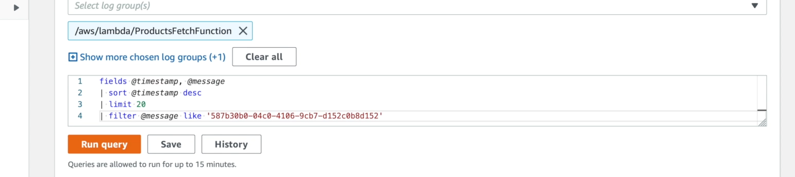
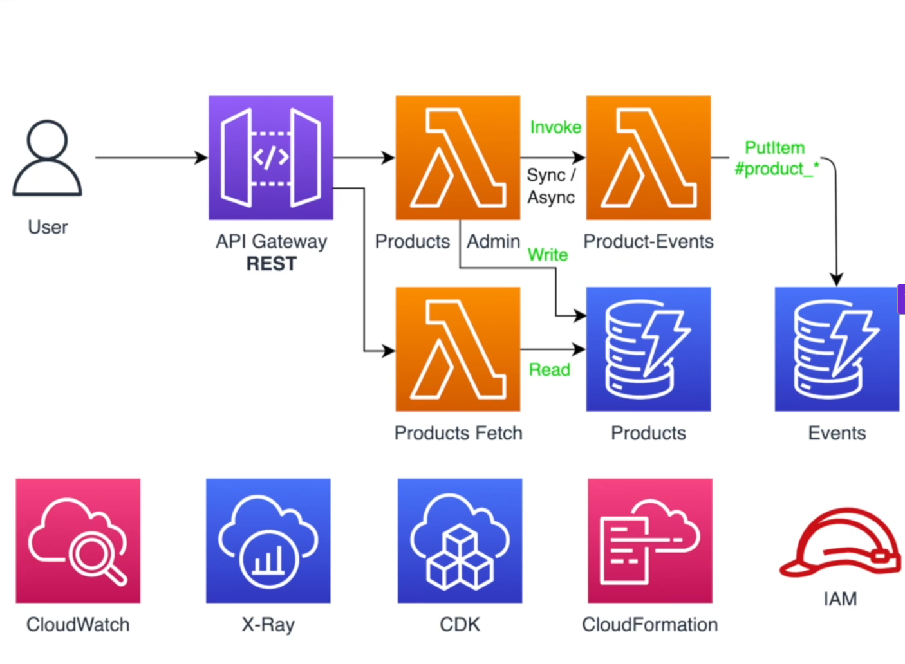

# Ecommerce project

## Arquitetura


## Stacks

- recursados que são corelacionados entre si
- Organização desses recursos depende de cada caso
  - colocar tudo em uma stack só
  - cada recurso tem sua propria stack
  - **O ideal  é encontra um meio de termo disso tudo**
- As Stacks podem ter dependencias entre si

### Exclusão de uma Stack

- **Os recursos tbm são apagados juntamente com a exclusão da stack**
- Obviamente isso deve ser configurado
  - uma tabela de de um database geralmente não é excluido

## Lambda 

- funções que são executados a partir de um trigger
- Excução em runtime
- Custo é cobrado
  - tempo de execução
  - memoria consumida
- ***otimizações devem ser feitas para os requisitos acima***

### Lambdas Layers

- Recursos, pedaços de codigos e libs que podem ser podemo ser compartilhadas com varias outras funções lambdas.
- Colocando esses recursos compartilhados podemos temos que as funções ficam menores
  - melhorando desempenho
  - cold start otimizado e afins

### AWS API GATEWAY 

- colocamos na frente de serviços que expoe APIS para o mundo externo
  - endpoit para ser consumido algum CLIENT
- validação de requests como:
  - URI
  - Verbos HTTP
  - payloads (body)
- Custo:
  - por requisição
  - e dados requeridos
  - mto mais barato que fazer direto
- Bloqueio de requisições que nossa infra não trata
  - ja eh bloqueado pela API gateway


## CDK 

### start a cdk project

```bash
cdk init --language typescript
```

### CDK WORKFLOW

- CODE IN CDK -> CLOUDFORMATION TEMPLATE -> RESOURCES CREATION AND ETC.

## Logs do cloudwatch e depuração pelo console da AWS

- modulo 6 do curso (para consultar depois)
- 31 a 34

### Logs Insights

- Agrupando logs de vários recursos ao mesmo tempo
- Posso pegar vários logs de vários logs groups e telos como resultado 
- 

## Arquiquetura bem dividida

### Gerenciamento de Produtos


pr