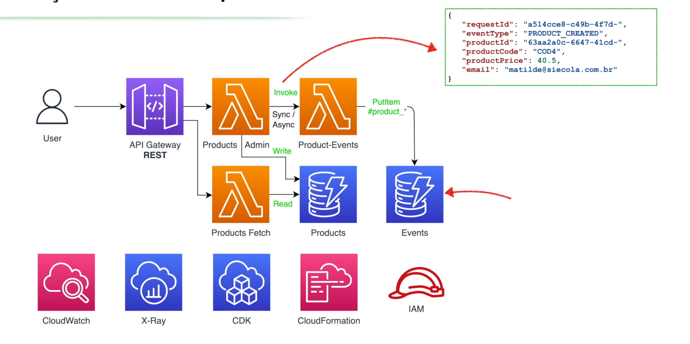

# Ecommerce project

## Arquitetura


## Stacks

- recursados que são corelacionados entre si
- Organização desses recursos depende de cada caso
  - colocar tudo em uma stack só
  - cada recurso tem sua propria stack
  - **O ideal  é encontra um meio de termo disso tudo**
- As Stacks podem ter dependencias entre si

### Exclusão de uma Stack

- **Os recursos tbm são apagados juntamente com a exclusão da stack**
- Obviamente isso deve ser configurado
  - uma tabela de de um database geralmente não é excluido

## Lambda

- funções que são executados a partir de um trigger
- Excução em runtime
- Custo é cobrado
  - tempo de execução
  - memoria consumida
- ***otimizações devem ser feitas para os requisitos acima***

### Lambdas Layers

- Recursos, pedaços de codigos e libs que podem ser podemo ser compartilhadas com varias outras funções lambdas.
- Colocando esses recursos compartilhados podemos temos que as funções ficam menores
  - melhorando desempenho
  - cold start otimizado e afins

### Invocação de uma função Lambda

#### Invocações síncronas

- A função é chamada e espera a resposta antes de continuar
- Exemplo:
  - **API Gateway** chama uma função Lambda e espera a resposta para retornar ao cliente
  - **Lambda** chama outra Lambda e espera a resposta antes de continuar

### Invocações assíncronas

- A função é chamada e não espera a resposta antes de continuar
- Exemplo:
  - **SQS** envia uma mensagem para uma fila e não espera a resposta
  - **SNS** envia uma mensagem para um tópico e não espera a resposta
  - **Lambda** chama outra Lambda e não espera a resposta antes de continuar
  - **DynamoDb**
    - quando um item é adicionado, atualizado ou excluído, um evento é gerado e enviado para uma fila SQS ou SNS
    - a função Lambda é acionada para processar esse evento

### AWS API GATEWAY

- colocamos na frente de serviços que expoe APIS para o mundo externo
  - endpoit para ser consumido algum CLIENT
- validação de requests como:
  - URI
  - Verbos HTTP
  - payloads (body)
- Custo:
  - por requisição
  - e dados requeridos
  - mto mais barato que fazer direto
- Bloqueio de requisições que nossa infra não trata
  - ja eh bloqueado pela API gateway

## CDK

### start a cdk project

```bash
cdk init app --language typescript
```

### CDK deploy sem interrupção de approval

```bash
 cdk deploy --all --require-approval never 
 ```

### Diferenças do que mudou com o deploy nas stacks e afins

```bash
 cdk diff
 ```

### CDK WORKFLOW

- CODE IN CDK -> CLOUDFORMATION TEMPLATE -> RESOURCES CREATION AND ETC.

## Logs do cloudwatch e depuração pelo console da AWS

- modulo 6 do curso (para consultar depois)
- 31 a 34

### Logs Insights

- Agrupando logs de vários recursos ao mesmo tempo
- Posso pegar vários logs de vários logs groups e telos como resultado 
- 

## Arquiquetura bem dividida

### Gerenciamento de Produtos


### Pq usar diferentes lambdas? se tratando de produtos?

- user apenas vão fazer operações de get
- admin pode fazer mtas mais operações porem com mto menos frequencia do que um usuario

## SSM Parameter Store 

- Um lugar seguro para guardar vários tipos de informações dentro da AWS.
- Assim não crio dependencias entre stacks e consigo compartilhar informações entre stacks.
  - exemplo:
    - uma stack de produtos pode pegar o nome do bucket de imagens de uma stack de imagens
    - compartilhar chaves de API, senhas, ARNs(Amazon Resource Names), etc.

## ARN (Amazon Resource Name)

- Identificador único de qualquer recurso dentro da AWS
- id de um lambda, nome de um bucket
- Exemplo:
- arn:aws:lambda:us-east-1:123456789012:function:my-function

### Execution Role  

- Permissões que uma função lambda tem para acessar outros recursos da AWS
- permissões que um recurso tem para operar dentro da AWS
  - exemplo:
    - DynamoDb tem que ter a permissão de ler e escrever em uma tabela, ou somente leitura
- **Essas permissões são definidas por uma política de IAM (Identity and Access Management)**

## Geração de eventos de Produtos

- Quando um produto é criado, atualizado ou excluído, um evento é gerado.
- Esses eventos podem ser capturados por outras funções Lambda ou serviços da AWS.
- Isso permite a criação de fluxos de trabalho assíncronos e reativos

